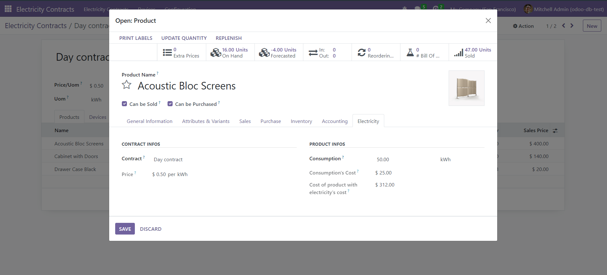
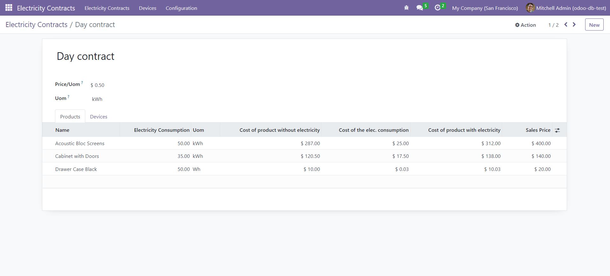

# Odoo App

## Purpose 
Odoo is the latest popular ERP system. It's considerably more efficient than the leading SAP, and surprisingly, much more affordable.
Odoo offers a range of apps to cater to most company requirements, but interestingly, there isn't one specifically for energy management.

Recent crises, such as the war in Ukraine, have highlighted the importance of energy for every businesses and the significance of an efficient energy management is poised to grow even further in the coming years. 
This is especially true with the ongoing electrification of society and the escalating importance of renewable energy sources, which tend to be less consistent compared to fossil fuels.
Furthermore, renewables present opportunities for even small companies to generate their own energy and potentially even sell any excess back to the grid. 
This potential for self-sustained energy production can be a game-changer for businesses of all sizes.

This app aims to assists companies in gaining a transparent overview of their electricity consumption, enabling them to make well-informed and effective decisions.

## Usage
[link to the app](https://apps.odoo.com/apps/modules/16.0/electricity_contract/)

The app will enable you to create multiple 'electricity contracts', with a price per kWh in your company currency.

On each product, a new tab will be available where you can select a contract and give it a consumption (for creating it, storing it, delivering it, ...). With those two pieces of information, the cost of your consumption will automatically be computed.

On the contract view, you will find a tab that lists every product linked to this contract. This will enable you to have a quick overview of the impact on your costs in the case of a change in the price of your contract.

